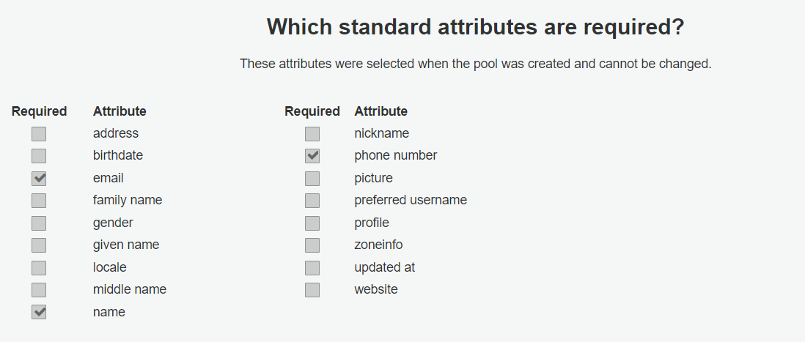

# 1. Set up
## 1.1. Pre configuration

The project uses the services of [AWS Cognito](https://aws.amazon.com/cognito/), [AWS DynamoDB](https://aws.amazon.com/dynamodb/), [AWS RDS](https://aws.amazon.com/rds/), [Amazon Connect](https://aws.amazon.com/connect/) and [AWS S3](https://aws.amazon.com/s3/).

The preconfiguration is aimed to set up the services and get the accesses to fill en `.env` file.

### 1.1.1. AWS Cognito

1. Create a User Pool in order to get `COGNITO_USER_POOL_ID` whih the following requirements:



2. Create an App Client in order to get de `COGNITO_APP_CLIENT_ID` and the `COGNITO_APP_SECRET_HASH`.

### 1.1.2. AWS DynamoDB

The IAM account must have access to DynamoDB. There is no more configuration needed, as the tables are automatically created. Using IAM account credentials, fill `AWS_ACCESS_KEY_ID` and `AWS_SECRET_ACCESS_KEY`. Finally, fill `AWS_REGION` with the corresponding region your system is alocated.

To create DynamoDB tables for the first time it is necessary to go to the [modelsNoSQL folder](../src/modelsNoSQL/) and uncomment all the last pieces of code of each model. After the tables are created comment this lines again.

### 1.1.3. AWS RDS

The IAM account must have access to RDS. In order for it to work properly choose MySQL as DB engine. Using the credentials created fill the `DB_NAME` with the name of the database, `DB_DIALECT` with the dialect you chose, `DB_USER` with the user needed to remotely connect to your database, `DB_PASSWORD` with the password used to remotely connect to your database and `DB_HOST`with the endpoint of your database.

Make sure that you have already created your database. To do this you need to use your cmd or Terminal application and execute the following command `mysql -u [YOUR DB_USER] -h [YOUR DB_HOST] -p`. After this type your `DB_PASSWORD` to connect to your database. Finally create your database using the SQL command `CREATE DATABASE [YOUR DB_NAME]`.

### 1.1.4. Amazon Connect

The IAM account must have acces to Amazon Connect. After creating an instance it is necessary to create three profiles: Agent, Quality Analyst and Manager. Finally, using the configurations of your Amazon Connect instance fill `CONNECT_INSTANCE_ID`, `CONNECT_ROUTING_PROFILE_ID`, `CONNECT_MANAGER_PROFILE_ID`, `CONNECT_QUALITY_ANALYST_PROFILE_ID` and `CONNECT_AGENT_PROFILE_ID`.

### 1.1.5 AWS S3

The IAM account must have acces to AWS S3. Create a bucket destined to store `.txt` files and make it and its objects public. After creating the bucket fill `S3_CLICK_KEY_BUCKET` with the name of your bucket.

### 1.1.6 HTTP and HTTPS ports.

Choose two ports where the HTTP and HTTPS protocols will run and fill `PORT` and `HTTPS_PORT`.

### 1.1.7 Node development environment.

Choose a development environment for your system between development (for testing), production (for deployment), staging (or preproduction, for applications near the deployment phase), and fill `NODE_ENV`.

### 1.1.8 Hash algorithm.

Select a hash algorithm that is compatible with Python 3.9 (we recommend sha256) and fill `HASH_ALGORITHM`.

### 1.1.9 TLS reject.

Choose between 0 and 1 to deny or allow TLS rejection and fill `NODE_TLS_REJECT_UNAUTHORIZED`. 
**WARNING**: Setting the `NODE_TLS_REJECT_UNAUTHORIZED` environment variable to 0 makes TLS connections and HTTPS requests insecure by disabling certificate verification. We only recommend to set this variable to 0 during testing environments.

## 1.2. Configure the EC2 instance and deploy the project

1. Follow the steps to create an EC2 instance with the AWS Management Console https://docs.aws.amazon.com/codedeploy/latest/userguide/integrations-partners-github.html, we recommend to choose a t2.medium processor and choose 15 GB of storage.

2. Install node.

    Installing nvm.
    ```sh
    sudo yum install curl -y
    curl https://raw.githubusercontent.com/creationix/nvm/master/install.sh | bash
    ```

    Reloading the environment. 
    ```sh
    source ~/.baschrc
    ```

    Install node using nvm
    ```sh
    nvm install node
    ```

    Install latest lts version
    ```sh
    nvm install lts/*
    ```

3. Install typescript globally.

    ```sh
    npm install typescript -g
    ```

4. Install pm2.

    [PM2](https://pm2.io/docs/plus/overview/) is a tool that helps to launch the project.

    ```sh
    npm install pm2 -g
    ```

5. Install git.

    Run a system update

    ```sh
    sudo yum update
    ```

    Install git

    ```sh
    sudo yum install git
    ```

6. Clone repository.

    ```sh
    git clone https://github.com/Amazon-Connect-Equipo-1/Back-end.git
    ```

7. Install node modules.

    ```sh
    npm install
    ```

8. Run any of the scripts the project has.

## 1.3 Scripts

The project has four main scripts to run: 

1. Transpiling the code.
   
    ```sh
    npm run build
    ```

2. Starting the server already transpiled.

    ```sh
    npm run start
    ```

3. Transpile and run the server.

    ```sh
    npm run test
    ```

4. Transpile and run the server as a background process.

    ```sh
    npm run app
    ```